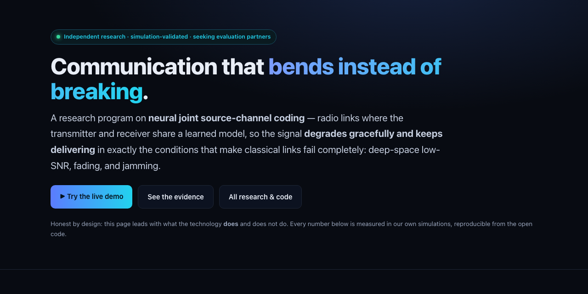

# Latent Comms

A public research hub for learned communication: neural joint source-channel transceivers that keep delivering as the channel degrades, measured honestly against the best digital baselines on contested, fading and deep-space channels.

  

**Try it: https://suncal.github.io/latent-comms/**

## What it does

- **Latent Radio**: the in-browser neural transceiver, +4.7 dB over a Shannon-separation baseline at low SNR
- **Rosetta**: three independently trained radios made interoperable through a shared reference standard and frozen-base adapters
- **Contested Channel v1–v4**: burst jamming, Rayleigh/Rician fading, adversarial follower-jammers, a hybrid digital-analog scheme, and a feedback-free regime where rate-adaptive digital delivers nothing
- **Sonic / Sigil / Aether / LoRa**: the same codec carried over sound, drawn as a fading glyph, invented by two agents, and stretched past LoRa's range cliff
- Honest framing throughout: where it wins, where it loses, and why

## Run it

The hub is static; open `index.html`. Each experiment links to its own report.

---

**If this is useful to you, a ⭐ on the repo helps other people find it.** Issues and pull requests are welcome.

Built by [Priyankar "Sunny" Chakraborty](https://github.com/suncal) · [everbuiltstudio.com](https://everbuiltstudio.com)
